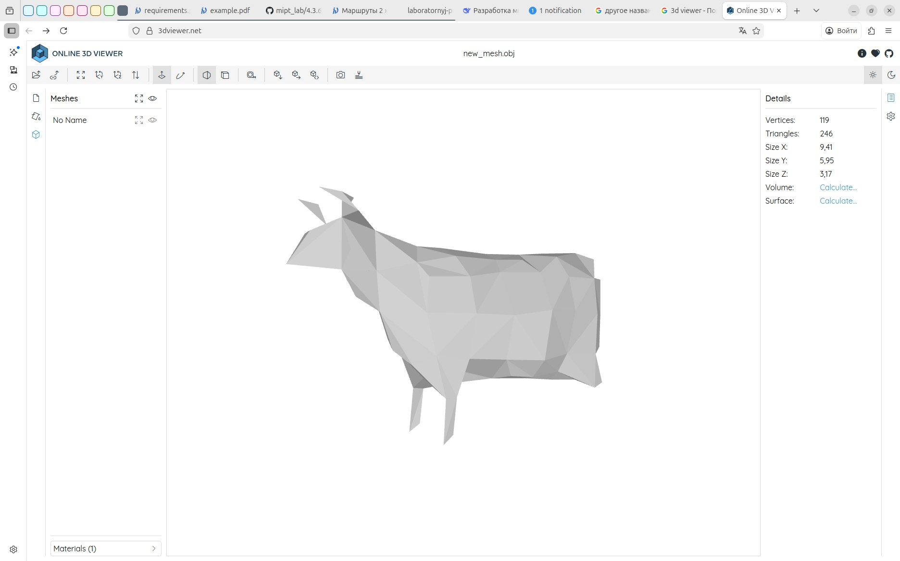
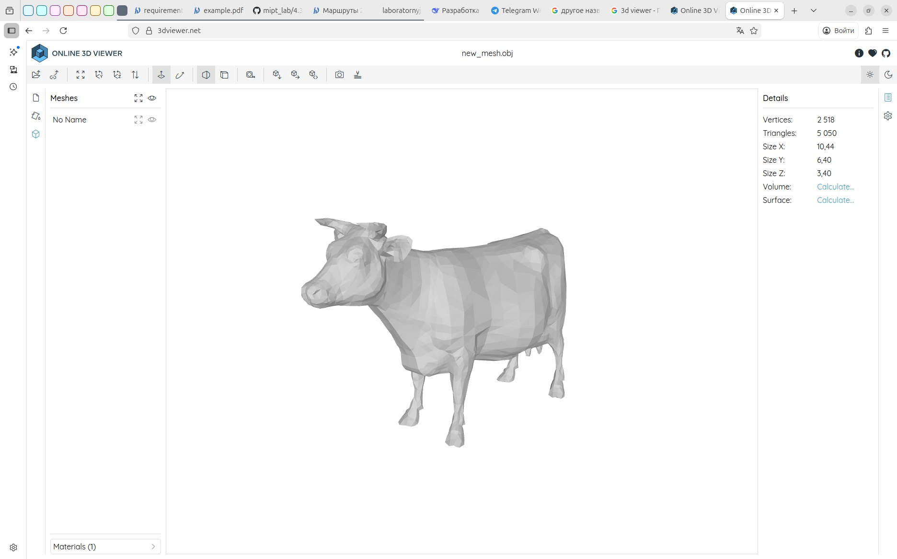
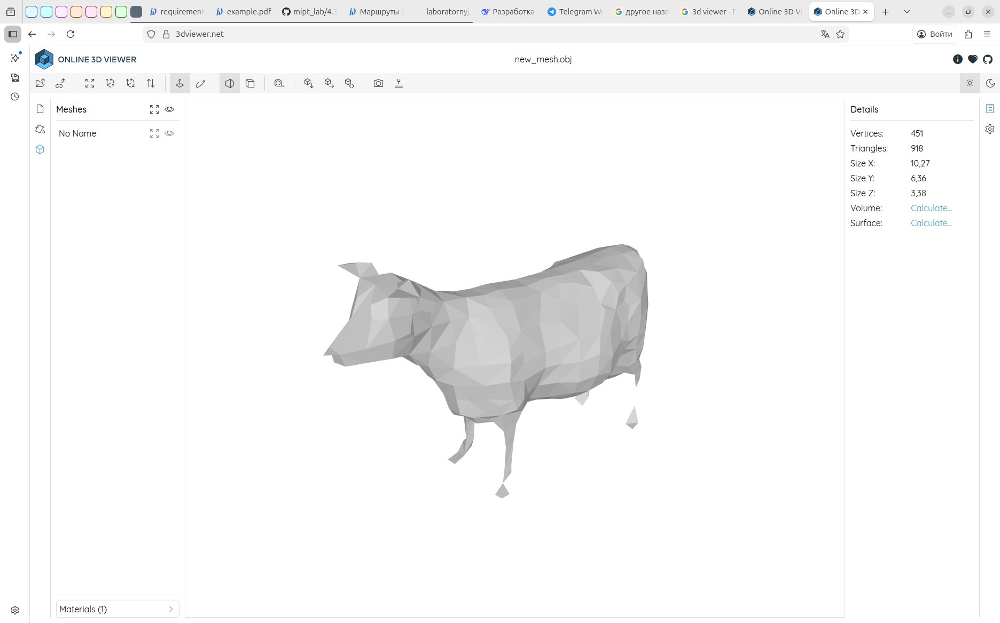

## mesh

### ветка mesh obj converter 

мы такие молодцы, мы осуществили такой замечательный алгоритм упрощения, как же он хорош. только, упс, никак не проверить, че он там делает. нужно посмотреть 3д вывод. для этого нужен конвертер из меша в мультифору. это мы и делаем здесь. пока что амбиции у нас невелики, поэтому форма face простейшая - только индексы вершин.

наш великолепный смелый конвертор готов и мы убедились, что фигура коровы упрощается с увеличением DETAIL_LEVEL

### ветка vertex_cluster - первый алгоритм упрощения сетки

это самый простой алгоритм. он заключается в том, что мы просто делим пространство на кубики-клетки и все вершины, попавшие в клетку, сливаем в одну, затем снова проводим триангуляцию. 

это простой и быстрый алгоритм, но его точность невелика, мелкие детали исчезают. модель сильно искажается. можно компенсировать это тем, чтобы варьировать размер ячейки, к примеру, если количество вершин, попавших в одну ячейку велико, больше фиксированного значения, можно поделить эту ячейку на ячейки меньшего размера

итого нужно
1. поделить пространство на ячейки
2. выделить вершины, попавшие туда
3. найти оптимальное местоположение одной результирующей вершины - получить новый список вершин
4. триангулировать снова, **перестроить старые связи, опираясь на новые вершины**

***Деление пространства***. нужно выделить ячейки, кубики. но чтобы было удобно работать с индексами, мы просматриваем всю модель и находим минимальную и максимальную границы, чтобы потом работать не со всем незримым пространством, а с конкретной частью пространства, занимаемой этой моделью. Затем нужно определить, на ячейки какого размера мы все будем делить. Для этого находим максимальнное расстояние по трем осям. Максимальное, потому что если мы будем опираться на минимальный размер или средний, представьте дощечку, это будет неоптимально, мы разобъем все на большое множество маленьких кубиков, не получив профита. Потом умножаем этот найденный размер на долю измельчения (0.01 для 1% и тд). Как раз выбор этого размерчика и определит то, насколько детализированной будет модель-результат.

***Распределение вершин по ячейкам***. просто просматриваем все вершины, по ним определяем ячейку, в которую они попали, а потом дополняем инфу по этой ячейке - обновляем сумму в CellData

***Нахождение оптимального положения новой вершины***. Очевидно, брать центр ячеки - не вариант (это очень неточно). Возьмем среднее по всем вершинам. Информация для этого уже содержится у нас в CellData.

***Триангулируем снова*** в процессе работы создаем таблицы, с помощью которых можно сопоставить старое и новое, так что по старым треугольникам ссылаемся на новые вершины и оставляем только невырожденные треугольники и пушим в новый меш. конкретно алгоритм таком, что мы заполняем хещ-таблицу cell_to_new_ind_ индексов новых вершин и клеток, в которых они находятся. затем каждой старой вершине сопоставляем новую хеш-таблицей old_to_new_v_, а затем просматриваем старые треугольники, формируя новые по соответствующим вершинам, опять же пользуясь активно old_to_new_v_, вырожденные треугольники отбрасываем.

Сейчас возникла необходимость в генераторе obj файла, чтобы можно было проверить, как работает кластер, в терминале это не очень удобно. Ну, переходим в третью ветку

После написания конвертора можно проанализировать сгенерированные модели и понять, что алгоритм действительно работает. Проверка на 3D модели коровы при разных значениях detail_level

### ветка base - начало работы 

сделано 

структура точки - vec3, есть все нужные операции

структура mesh. пока заниваемся только vertex cluster нам достаточно хранить только вершины и треугольники. плюс добавим методы для дополнения, сохранив инкапсуляцию.

парсер. obj формат довольно простой. построчный и первым компонентом содержит обозначение того, что будет дальше в строке: 

v — вершина, vt — текстурные координаты, vn — нормаль, f — грань

f всегда ссылается именно на int, то есть на позиции в списке вершин. нужно еще учесть, что позиции могут быть отрицательными. это связано с тем, что берутся относительные индексы - с другого конца вектора - последние добавленные. еще раз - последние добавленные, а не просто последние, поэтому это и должно быть обработано в процессе парсинга.

пока что мы задаем без нормалей и текстурных координат, вообще формат будет типа v/vt/vn или v//vn или просто v

причем индексы в obj отсчитываются с 1, поэтомы при заполнении face мы будем вычитать 1, чтобы потом просто обращатья по индексу

нужно все триангулировать, потому что обычно в obj файлах встречается деление face не на треугольники, а на что-то другое. поэтому в процессе придется проводить триангуляцию. это происходит в конструкторе mesh

Результат для куба

Вершины куба

v -1 -1 -1  # 0

v  1 -1 -1  # 1

v  1  1 -1  # 2

v -1  1 -1  # 3

v -1 -1  1  # 4

v  1 -1  1  # 5

v  1  1  1  # 6

v -1  1  1  # 7

если взять faces по треугольникам:

f 1 2 3

f 3 4 1

f 2 6 7

f 7 3 2

f 6 5 8

f 8 7 6

f 5 1 4

f 4 8 5

f 4 3 7

f 7 8 4

f 5 6 2

f 2 1 5

результат 

vertices

-1 -1 -1

1 -1 -1

1 1 -1

-1 1 -1

-1 -1 1

1 -1 1

1 1 1

-1 1 1

triangles

0 1 2

2 3 0

1 5 6

6 2 1

5 4 7

7 6 5

4 0 3

3 7 4

3 2 6

6 7 3

4 5 1

1 0 4

для файла в faces. заданными прямоугольниками:

f 1 2 3 4

f 5 6 7 8

f 1 2 6 5

f 2 3 7 6

f 3 4 8 7

f 4 1 5 8

результат 

triangles

0 1 2

0 2 3

4 5 6

4 6 7

0 1 5

0 5 4

1 2 6

1 6 5

2 3 7

2 7 6

3 0 4

3 4 7

то есть все хорошо, все работает. Надо бы еще тесты добавить, но чуть позже