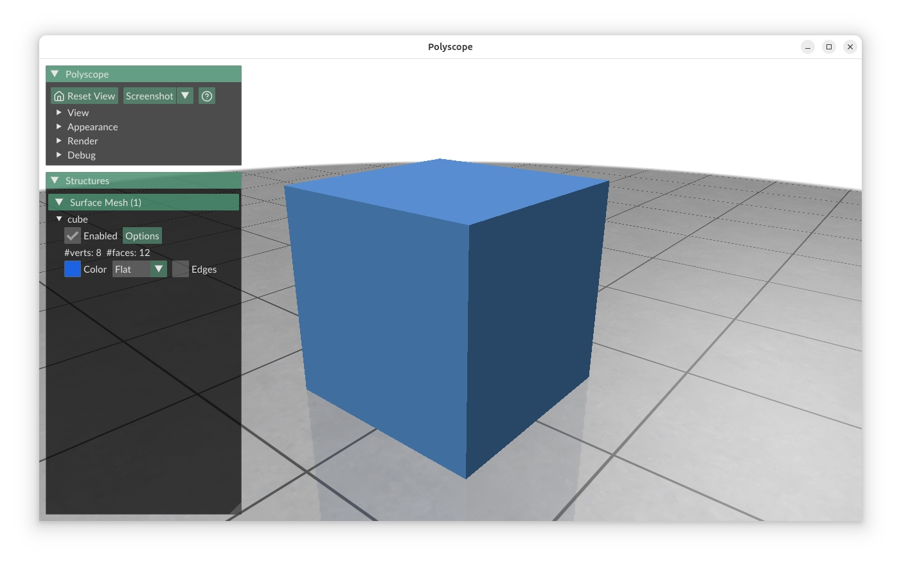
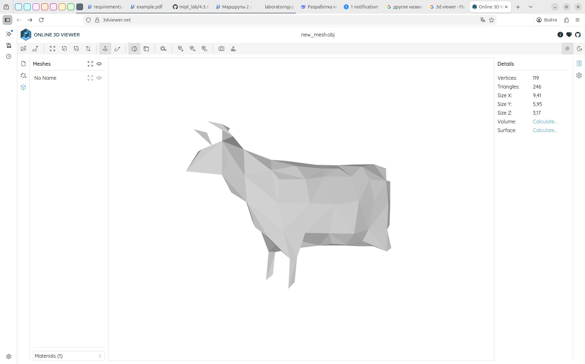
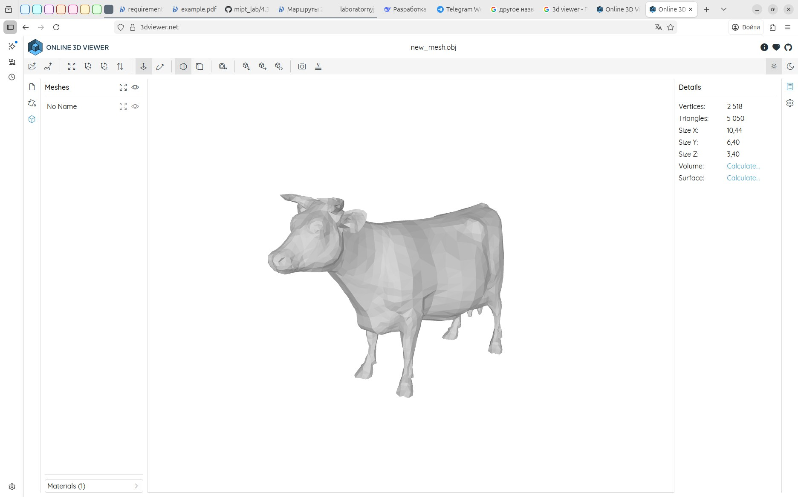
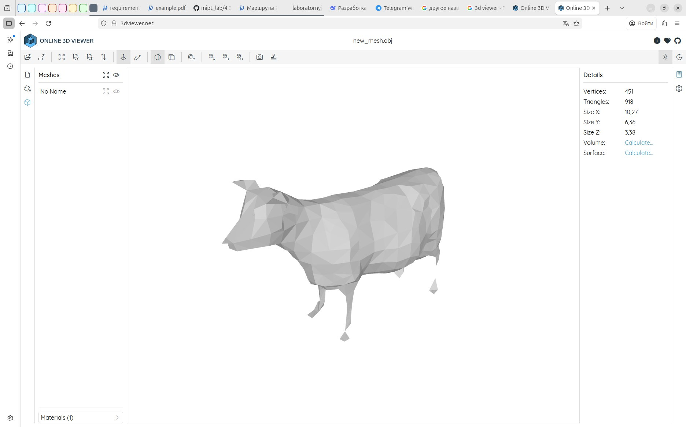
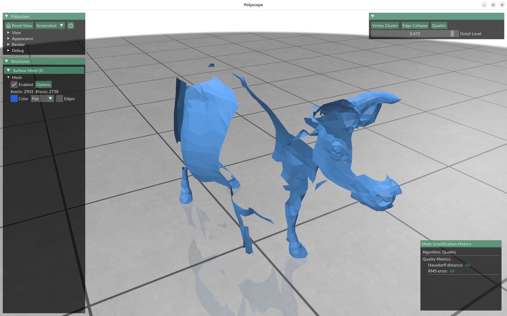
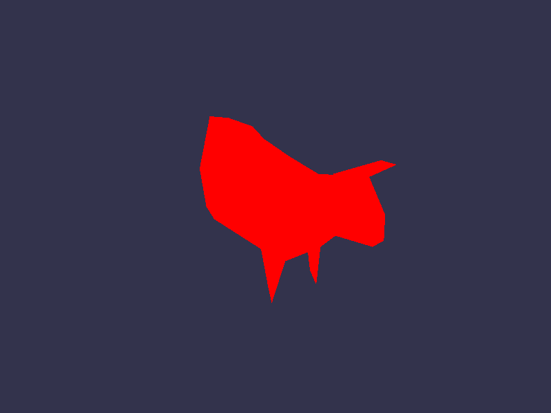
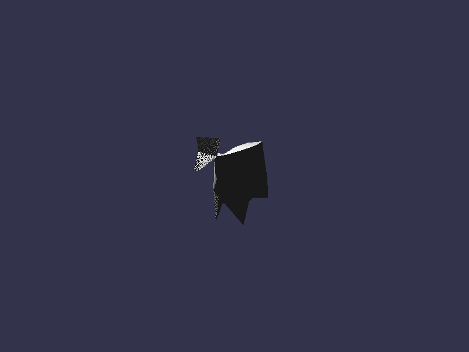
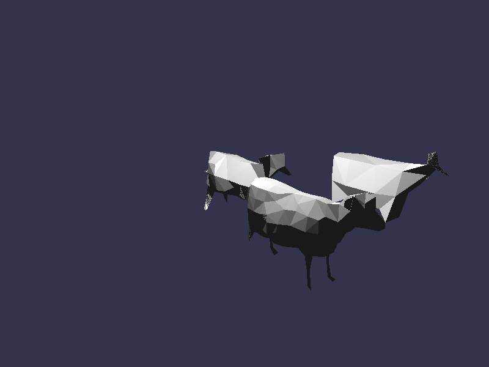
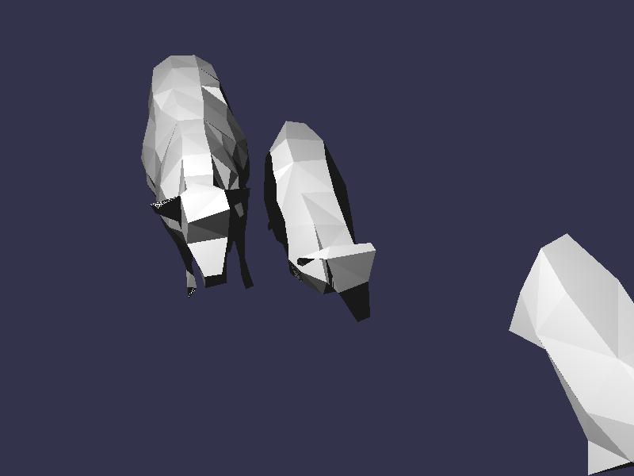

## mesh

### ветка edge_collapse - второй алгоритм упрощения сетки

суть в том, чтобы взять две вершины, которые стягивает одно ребро и схлопнуть их, отбросив треугольники, ставшие вырожденными. для этого алгоритма о сеше придется знать больше, чем было при первом алгоритме. нужно дополнить структуру mesh. вернемся в ветку base и сделаем наследника, это будет хорошо. 

**этап подготовки**

1. перестроить данные. нужно, чтобы вершина знала о том, в какие треугольники она входит и о соседних вершинах. добавить структуру ребра, найти все ребра
2. посчитать стоимость всех ребер - длина, дрина * кривизна, квадратичная ошибка. пока возьмем длину. Плюс организовать все ребра пос троимости в кучу, чтобы быстро получать самое низкое по стоимости.

здесь сделаем пометку, что алгоритм предназначен для корресктных стркутур - таких, что за  ребро закреплено максимум два тругольника

**алгоритм**

1. Выбираем вершину для удаления.
2. находим новое положение - среднее
3. правим данные вершин о соседях вершинах и треугольниках, в которые они входят. перенаправляем все трегольники со старой в новую.
4. редим треугольники, удаляем вырожденные
5. правим соседей новой вершины
6. пересчитываем стоимости ребер, связанные с новой вершиной, тк они поменялись

при удалении вершины не удаляем ее из списков и не перезаполняем все, что нужно заполнить, а просто делаем пометку, чтобы дальше она не обрабатывалась. мы работаем с кучей и нам выгоднее использовать ленивое удаление.

ну вот, переходим теперь в base и делаем наследника с нужными данными. 

Так, все работает. В base поправили, сам алгортм написали, он работает. Теперь нужно поправить detail_level. В данном случае алгоритм удаляет ребра (да-да) до тех пор, пока не достигнет определенного количества трегольников (EdgeCollapse::final_triangles_amt_). Нам нужно на этот раз не напортачить как в прошлый раз и сделать так, чтобы с увеличением ппараметра детализация увеличивалась (в vertex cluster) потом тоже поправим. Поэтому сделаем так, чтобы параметр был долей единицы - доли от общего количества трегольников, собственно. 

Этот метод намного дольше, чем vertex_cluster. Это заметно и при отображении одного типа detail_level отдельно. При добавлении в интерфейс polyscope почти невозможно работать. Все сразу тормозит. Да, можно подождать и видно, что действительно этот метод выглядит получше, чем результат vertex_cluster при том же уровне detail_level (опять же, это пока не очень объективно, пока мы не поправили параметр в первом методе). Двигать ползунком просто невозможно, пересчет по методу занимает очень много. 

Это ожидаемо, сложность этого алгоритма O(n log n), у vertex_cluster это всего лишь O(n).

Так как нам все равно нужно показать пользователю результат, добавим предупреждение при переходе во вкладку с этим алгоритмом и выполнение алгоритма будет начинаться только при отпускании ползунка (когда ползунок попущен, да.. очень смешно).

Изменение только при отпускании ползунка реализовано, добавлены сообщеение при первом переключении на edge collapse и при движении ползунка (о том, что его надо отпустить).

Да, кстати, мне кажется, это не настолько серьезные изменения, поэтому я это делаю сразу в ветке edge_collapse, а не в mesh_viewer. Ну, я одна работаю, какая разница, могла и в мэйне вообще делать. Ох уж эти ветки. 

Кстати, да, я потом сделаю коммит, в котором разделю не хэдеры и сипипишники, правда. Честно. Я это сделаю, но чуть позже. когда с алгоритмами будет покончено. Пока не возникало... да че я вам пишу это вообще все, какая разница. 

### ветка metrics

Нужно, конечно, проверить, насколько наше упрощение корректно. Для этого нужно измерить метрики. Есть несколько типов метрик. На данный момент, нив obj файле, которым я пользуюсь, ни в файле, который я генерирую, нет нормалей. Для метрик, оценивающих гладкость модели, это более глубокий анализ, они понадобятся. Пока что реализуем метрики, которые не требуют этого, а затем добавим нермали и дополним новыми метриками. 

Чтобы метрики имели смысл, нужно их нормализовать относительно модели и выразить в процентах.

##### Расстояние Хаусдорфа

Эта метрика оценивает самое большое расстояние от любой точки одной модели до ближайшей точки другой модели. То есть то, насколько далеко самая плохая точка упрощенной модели уехала от оригинала. Проблема может быть в том, что одна точка уехала далеко, а остальные хорошо вписываются.

Хорошо, если метрика < 0.1%, плохо, если > 1%

##### Степень сжатия

Сколько треугольников удалено. Это никак не оценивает качетво получившейся модели, поэтому это осуществять не будем. Точнее, не будем выносить как отдельную метрику, она бессмысленна. Количество треугольников и так одно из важных характеристик модели, оно все равно отображается везде. 

##### Среднеквадратичная ошибка, RMS

Среднее расстояние между двумя моделями. RMS смотрит на общую картину, в этом его преимущество перед расстоянием Хаусдорфа. Проблема возникает в том, что результат будет зависеть от того, от какой модели мы стартуем. у упрощенной модели будет меньшее количество вершин, у нее больше выборка для нахождения минимального расстояния. Можно взять и просуммировать в обе стороны и усреднить. Но нас интересует именно отклонения упрощенной модели, поэтому посчитаем от нее, нам этого достаточно.

Хорошо, если метрика < 0.05%, плохо, если > 0.5%

### ветка mesh_viewer

Лучше сделать так, чтобы отображение 3д модели не зависело от доступа к интернету. Поэтому мы интегрируем свой вьюер. Нужные библиотеки уже существуют. Попробуем использовать библиотеку polyscope. Для того, чтобы у пользователя не возникало проблем, вставим в дальнейшем скачивание и активацию в симейк. Стоит сказать, то, несмотря на то, что библиотека кросспрлатформенная, есть часть зависимостей, связанных с визуализацией. В случае линукса, нужно частично дополнять. Нужно скачивать пакеты libxrandr-dev и xorg-dev. Polyscope собирает GLFW (библиотека для окон) из исходников. GLFW для работы в Linux требует заголовочные файлы X11-расширений, включая RandR для управления разрешением экрана. В системе обычно есть скомпилированные библиотеки (.so), но для компиляции нужны ещё и заголовочные файлы (.h) из пакетов -dev. Пакет libxrandr-dev как раз содержит эти заголовки . А xorg-dev — это мета-пакет, который стянет всё необходимое для разработки под X11 (Xlib, Xinerama, Xcursor, Xrandr, Xi и т.д.). И еще кое-что особое делать при прикреплении библиотеки в симейк файл.

Конечно, теперь все долго собирается. И вообще выглядит не очень красиво, онлайн вьюер был более симпатичный. Ну, зато без интернета. И все свое. 

Проблема с тем, как определяется и высчитывается верхняя граница упрощения. Минимальная граница упрощения, очевидно, 0. А верхняя будет зависеть от алгоритма. К примеру, рамках вертекс кластера, нужно смотреть на развиение по клеткам. Пока что вставлено фиктивное число, при достижении которого не возникает ошибки (связанной с невозможностью отображения). В дальнейшем это, конечно, решим. Точно, босс.

### ветка mesh obj converter 

мы такие молодцы, мы осуществили такой замечательный алгоритм упрощения, как же он хорош. только, упс, никак не проверить, че он там делает. нужно посмотреть 3д вывод. для этого нужен конвертер из меша в мультифору. это мы и делаем здесь. пока что амбиции у нас невелики, поэтому форма face простейшая - только индексы вершин.

наш великолепный смелый конвертор готов и мы убедились, что фигура коровы упрощается с увеличением DETAIL_LEVEL

### ветка vertex_cluster - первый алгоритм упрощения сетки

это самый простой алгоритм. он заключается в том, что мы просто делим пространство на кубики-клетки и все вершины, попавшие в клетку, сливаем в одну, затем снова проводим триангуляцию. 

это простой и быстрый алгоритм, но его точность невелика, мелкие детали исчезают. модель сильно искажается. можно компенсировать это тем, чтобы варьировать размер ячейки, к примеру, если количество вершин, попавших в одну ячейку велико, больше фиксированного значения, можно поделить эту ячейку на ячейки меньшего размера

итого нужно
1. поделить пространство на ячейки
2. выделить вершины, попавшие туда
3. найти оптимальное местоположение одной результирующей вершины - получить новый список вершин
4. триангулировать снова, **перестроить старые связи, опираясь на новые вершины**

***Деление пространства***. нужно выделить ячейки, кубики. но чтобы было удобно работать с индексами, мы просматриваем всю модель и находим минимальную и максимальную границы, чтобы потом работать не со всем незримым пространством, а с конкретной частью пространства, занимаемой этой моделью. Затем нужно определить, на ячейки какого размера мы все будем делить. Для этого находим максимальнное расстояние по трем осям. Максимальное, потому что если мы будем опираться на минимальный размер или средний, представьте дощечку, это будет неоптимально, мы разобъем все на большое множество маленьких кубиков, не получив профита. Потом умножаем этот найденный размер на долю измельчения (0.01 для 1% и тд). Как раз выбор этого размерчика и определит то, насколько детализированной будет модель-результат.

***Распределение вершин по ячейкам***. просто просматриваем все вершины, по ним определяем ячейку, в которую они попали, а потом дополняем инфу по этой ячейке - обновляем сумму в CellData

***Нахождение оптимального положения новой вершины***. Очевидно, брать центр ячеки - не вариант (это очень неточно). Возьмем среднее по всем вершинам. Информация для этого уже содержится у нас в CellData.

***Триангулируем снова*** в процессе работы создаем таблицы, с помощью которых можно сопоставить старое и новое, так что по старым треугольникам ссылаемся на новые вершины и оставляем только невырожденные треугольники и пушим в новый меш. конкретно алгоритм таком, что мы заполняем хещ-таблицу cell_to_new_ind_ индексов новых вершин и клеток, в которых они находятся. затем каждой старой вершине сопоставляем новую хеш-таблицей old_to_new_v_, а затем просматриваем старые треугольники, формируя новые по соответствующим вершинам, опять же пользуясь активно old_to_new_v_, вырожденные треугольники отбрасываем.

Сейчас возникла необходимость в генераторе obj файла, чтобы можно было проверить, как работает кластер, в терминале это не очень удобно. Ну, переходим в третью ветку

После написания конвертора можно проанализировать сгенерированные модели и понять, что алгоритм действительно работает. Проверка на 3D модели коровы при разных значениях detail_level

### ветка base - начало работы 

сделано 

структура точки - vec3, есть все нужные операции

структура mesh. пока заниваемся только vertex cluster нам достаточно хранить только вершины и треугольники. плюс добавим методы для дополнения, сохранив инкапсуляцию.

парсер. obj формат довольно простой. построчный и первым компонентом содержит обозначение того, что будет дальше в строке: 

v — вершина, vt — текстурные координаты, vn — нормаль, f — грань

f всегда ссылается именно на int, то есть на позиции в списке вершин. нужно еще учесть, что позиции могут быть отрицательными. это связано с тем, что берутся относительные индексы - с другого конца вектора - последние добавленные. еще раз - последние добавленные, а не просто последние, поэтому это и должно быть обработано в процессе парсинга.

пока что мы задаем без нормалей и текстурных координат, вообще формат будет типа v/vt/vn или v//vn или просто v

причем индексы в obj отсчитываются с 1, поэтомы при заполнении face мы будем вычитать 1, чтобы потом просто обращатья по индексу

нужно все триангулировать, потому что обычно в obj файлах встречается деление face не на треугольники, а на что-то другое. поэтому в процессе придется проводить триангуляцию. это происходит в конструкторе mesh

### комментарий насчет

работать с разными ветками непривычно. послесоздания ветки converter я написала там код, но, не закоммитив, пеереключилась в cluster, чтобы там дописать и все такое. короче, в итоге все изменения в ветке cluster, но я ее тоже походу не так запушила. ну, вот так короче, моя великая вина, извиняйте.

### Quadric - улучшенная метрика для edge_collapse

Так как это просто новая метрика, отнаследуем от EdgeCollapse и перезапишем функцию рассчета стоимости ребра. Не обходиом также добавить нормали. 

Пока что добавлен математический аппарат - матрицы, некоторые функции для матриц, алгорит Гаусса для решения матричного уравнения (понадобится для нахождения оптимального положения).

больших усилий все это стоит, очень много проблем. корова рвется на части. 

тяжело это все движется, поэтому решаю, что нужно доделать остальные маленькие элементы: detail_level чтобы правильно отображался, метрики подсвечивались цветами, сделать вывод нескольких моделей и попробовать сделать трассировку лучей. сразу уже сейчас хочу сказать, что тени не получится встроить в полископ. придется делать кнопку для вывода отдельной картинки с тенями. да и то я не очень уверена, что получится сделать трассировку

### Правки на момент 08.04 

//больше объектов

//освещение - алгоритм трассировки лучей

//проверить библиотеку

### Улучшения

detail_level поправила на share of simplify. для разных алгоритмов он задается разными параметрами. для vertex_cluster это размер клетки, что что с увеличением клетки детализация падает. в случае edge_collapse это финальное количество треугольников. с увеличением треугольников увеличивается детализация. Эти данные несопоставимы, поэтому алгоритмы стоит сравать по метрикам - в том числе по количеству треугольников в финальной модели. 

цвет для метрик сделан. стоит сказать, что по расстоянию хаусдорфа очень легко переходится граница в 0.1% и переход в желтый сектор. но переход к расный сектор, достижение 1%, по этой метрике сложен.

тееперь сделаю отображение нескольких мешей.

отображение нескольких мешей сделано. пока сыро, но их можно добавлять, удалять, отдельно упрощать, размещать в разных местах и менять цыета независимо. пока все работает неплохо.

теперь сделаем трассировку лучей. как было сказано, в полископ нельзя вставить тени просто так. поэтому просто добавим в юай отдельную кнопку, при нажатии на которую запускается рассчет трассировки в отдельном потоке, а потом в новом окне полявяется картинка с тотбраженными тенями. для реализации (конкретнее - отрисовки картинки) понадобится однофайловая библиотека stb_image_write. она кросплатформенная, написана на чистом си, помимо этого, она очень легковесная. картинка открывается в просмоторщике, соответствующем операционной системе. 
При подключении надо активировать макрос для включения этой библиотеки. соответственно, это нужно сделать в cpp, чтобы из-за повторного включения hpp-файла не возникло повтора и, соотвественно, ошибки компиляции. на момент осуществения этой записи я пока не перенесла методы из hpp файлов в cpp, что стоило сделать давно... в общем, здесь это обязательно делать.

трассировщик имитирует путь света: для каждого пикселя экрана пускается луч, находится пересечение с объектами (по треугольникам, алгоритм Möller–Trumbore), находть ближайщее пересечение. Исключаеся самозатемнение - пересечение с очень близкими объектами. В точке пересечения вычисляется нормаль. Вычисляется цвет с учётом освещения и теней.

алгоритм Möller–Trumbore:

луч задается уравнением прямой, а треугольник - тремя вершинами. любая точка треугольника задается барицентрическими координатами, то есть P = α * A + β * B + γ * C. P - это произвольная точка, α, β, γ - доли близости этой точки к каждой из вершин трегольника, если они все больше 0 и в сумме дают 1, то точка принадлежит треугольнику. сначала мы рассчитываем через смешанное произведение edge1 edge2 и D проекцию D на нормаль и определяем, стоит ли вообще учитывать это луч или он почти паараллелен плоскости, а также то, направлен луч на треугольник или на его обратную сторону (по знаку определителя). для вычисления долей используется 1/abs(det) и соотношение площадей треугольников.

при расчете цвета (модель освещения Phong): 

Ambient — базовое освещение (всегда есть, даже в тени)

Diffuse — рассеянный свет (зависит от угла падения света на поверхность) - матовая поверхность, свет, который равномерно рассеивается во все стороны

Specular — блики (зеркальное отражение от источника света) 

стоит сказать, что трассировка лучей - долгий процесс. если модель не упрощена, это может занять несколько минут.

долгая настройка синхронизации с камерой полископа. 

вот здесь вот отображено, что камера правда захватила модель. она отображена красным, а фон - синим.

вот здесь вот видно, как действительно отображается тень на модели. однако перед этой коровкой стояла еще одна и рассчет был на то, что захват будет обоих объектов и они обе отобразятся, но не вышло

поправила обработку положения коровы и теперь получается наблюдать несколько объектов

также можно наблюдать тень, которую отбрасывает один объект на другой

потребовалась работа с камерой. как и, например, в юниджайне, стандартная практика, есть мировые координаты и координаты камеры (у камеры обычно другие оси). между ними нужно совершать преобразования. преобразовываем координаты камеры в мировые, чтобы получить оси камеры

### возврат к квадрику :6

корова сыпется не по дням, а по легким движениям ползунка. нужно тчо-то делать. по выводу получается, что в матрицах куча нанов. ошибки накапливаются, данные обновляются неправильно, ребра теряются. надо сделать это поаккуратнее и все будет хорошо.

при вырождении матрицы мы теперь переходим к рассчету стоимости по длине ребра. то есть возвращается к метрике, характерной для обычного простого эдж коллапс. 